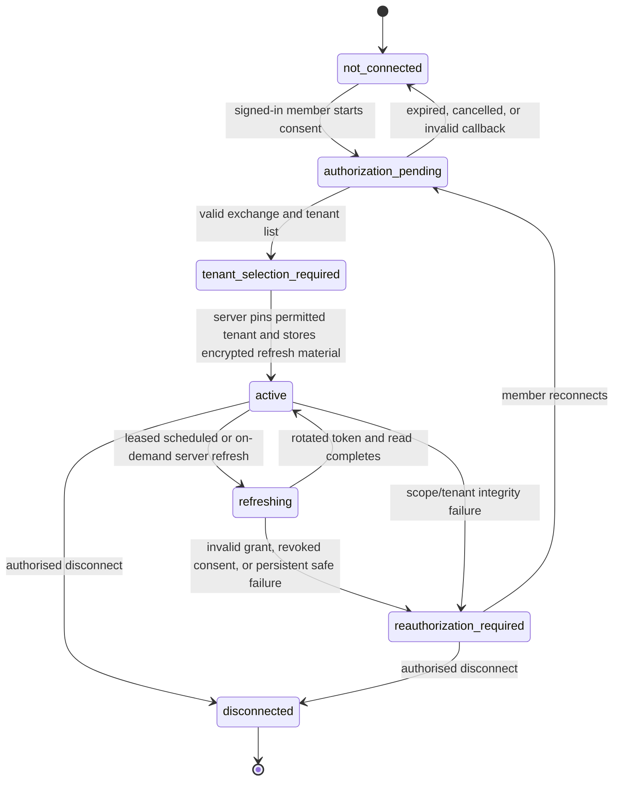

# Xero merchant credential lifecycle design — 18 September 2026

Status: **approved for development/staging prototype implementation.** The design and mock-test plan may now be implemented against local, disposable or verified staging infrastructure. It does not authorise a production OAuth application, production database migration, production recurrent collection, use of real merchant credentials, or access to/display of real merchant financial data.

## Purpose and boundary

Night Scout needs a server-only connection lifecycle before it can refresh a merchant's Xero account directory or accounting reports. The connection belongs to one Night Scout store and one pinned Xero tenant. It supplies Xero accounting data independently of Shopify: it must never be used to match, reconcile or force agreement with commerce data.

The lifecycle is deliberately separate from the existing local, loopback-only Xero proof. Local test files, test-app credentials and local evidence must not become a source of merchant connection state.

## Security decisions

| Decision | Design |
| --- | --- |
| OAuth grant | Standard authorization-code flow with PKCE and a per-attempt, single-use state record. |
| Callback | Server-controlled HTTPS callback from an allow-listed exact URI. The browser never receives a token, refresh token, client secret or raw Xero response. |
| Identity | The server derives the signed-in user and selected Night Scout store from the verified session. Client-supplied user, store, tenant, role and callback targets are ignored. |
| Tenant pin | After exchange, the server lists available connections once and requires an explicit tenant selection. It verifies that the selected tenant was returned by Xero, then binds it immutably to the store connection. Any tenant change is a new connection and requires mapping review. |
| Permissions | Request only the Xero scopes needed for the enabled read-only feature. No write, payroll, contacts or files scopes. Scope expansion requires a new consent record and review. |
| Credential storage | Store encrypted refresh-token material only in a server-only credential boundary, separate from mapping and accounting tables. Encrypt with an envelope-encryption design: a managed key-encryption key protects per-record data-encryption keys; store key version and ciphertext metadata, never keys beside ciphertext. |
| Access | Only a dedicated server worker identity may decrypt or refresh a credential. Browser roles, API read routes, logs, analytics, support exports and database read replicas cannot retrieve plaintext credentials. |
| Logging | Redact `Authorization`, OAuth codes, state, client secrets, access/refresh tokens and raw provider error bodies before logs, traces, alerts or audit exports. Store only event type, connection reference, outcome, safe reason and timestamps. |
| Refresh | A worker acquires a per-connection lease, decrypts only for the token request, rotates persisted refresh material atomically, then clears plaintext from process memory as far as the runtime allows. It never returns a token to a caller. |
| Failure | Invalid-grant, revoked-consent, tenant-unavailable, scope-change or repeated refresh failures set the connection to `reauthorization_required`; retain prior supported output only with its original freshness state and never silently fabricate a zero result. |
| Disconnect | A signed-in authorised store member may request disconnect through a server command. It disables refresh immediately, revokes provider access where supported, deletes encrypted credential material, records a value-free audit event and makes mappings require review. Historical mapping provenance may remain under the separately agreed retention policy. |

## Lifecycle state machine

State transitions are server-owned. The browser may request `authorization_pending`, select a tenant from the server-provided list, request reconnect, or request disconnect only when its verified membership allows it.

## Minimal server-side records

The later applied schema should keep these separate from `xero_v1` mapping records:

- **connection record:** opaque connection ID, store ID, tenant ID, status, approved scope-set version, creation/last-success/last-failure timestamps and safe status reason;
- **credential record:** opaque connection ID, encrypted refresh material, encryption-key version, creation/rotation/expiry metadata and a concurrency version; and
- **audit record:** action (`consent_started`, `tenant_pinned`, `refresh_succeeded`, `refresh_failed`, `reauthorization_required`, `disconnected`), server-derived actor where applicable, time and safe reason.

Do not store access tokens after use. Do not store client secrets in the database. Do not put credentials, raw reports, financial values, Shopify identifiers or free-form provider payloads in any of these records.

## Callback and tenant-selection protocol

1. The authenticated Settings action creates a short-lived consent attempt bound to session, store, PKCE verifier, exact callback URI and nonce/state hash.
2. The browser is redirected to Xero. It receives no Night Scout secrets.
3. The callback validates HTTPS origin, state single-use/expiry/session/store binding and OAuth error shape before token exchange.
4. The server exchanges the code, retrieves the available tenant list, and exposes only safe tenant display fields to the authenticated tenant-selection screen.
5. The member selects one returned tenant. The server re-checks membership, atomically pins the tenant and writes encrypted refresh material and an audit event.
6. It starts a fresh account-directory refresh through the server worker. Mapping confirmation remains blocked until a valid directory is available.

Expired, replayed, cross-session or cross-store consent attempts fail closed and leave no credential record.

## Mock and test plan

All implementation tests must use in-memory fakes or disposable databases. No test fixture may contain a live client secret, OAuth code, state, access token, refresh token, Xero tenant ID or raw report.

| Area | Required cases |
| --- | --- |
| Consent attempt | Requires verified identity and membership; expiry/replay/cross-session/cross-store state fail closed; redirect URI is exact; state/PKCE values never appear in response or logs. |
| Callback exchange | Provider success transitions only to tenant selection; malformed response, denied consent and safe provider error leave no encrypted credential; raw provider body is redacted. |
| Tenant pinning | Only tenant IDs supplied by the mock provider may be selected; duplicate store/tenant and cross-store attachment fail; a tenant change produces a new connection and mapping review. |
| Encryption boundary | Credential repository accepts ciphertext envelope only; mapping and API read repositories cannot query it; fake decryptor is invoked only by the worker; key-version rotation is testable. |
| Refresh/rotation | Lease prevents concurrent refresh; successful refresh atomically replaces credential version; injected write failure retains prior valid credential; plaintext is absent from all return values and audit events. |
| Authorisation | Non-members and revoked members cannot start, select, reconnect, read connection details or disconnect; server derives store/user; browser cannot choose a worker identity. |
| Failure/recovery | Invalid grant and revoked consent yield `reauthorization_required`; transient failure keeps prior freshness visible; reconnect succeeds only through a fresh consent attempt. |
| Disconnect | Stops future refresh, clears the credential envelope, issues mock provider revocation where enabled, writes a safe audit event and causes mapping review. Repeated disconnect is idempotent. |
| Data isolation | Two stores/two tenants cannot read or mutate each other's connection, credential metadata, directory or audit rows. Confirm no mapping, report or Shopify field enters credential records. |
| HTTP contract | APIs use no-store responses, value-free safe schemas and fixed error classes. Assert token-like strings never appear in status, JSON, headers, logs or metrics test captures. |

## Implementation order

1. Define value-free connection, credential-envelope and audit contracts plus fake KMS, provider and clock.
2. Implement consent-attempt and tenant-pinning service with exhaustive mock tests.
3. Implement encrypted credential repository, lease/refresh worker and disconnect path with isolation and failure tests.
4. Add server-only routes and Settings connection states; retain the current local preview as a separate test artefact.
5. Submit the schema/migration and credential-runtime configuration for a separate live review. Only after approval and configured secret infrastructure may real merchant consent be enabled.

## Agreed policy inputs and remaining boundaries

The 18 September prototype approvals in [agreed Xero prototype policies](consolidated-decision-pack-2026-09-18.md) set the accounting basis (accrual/P&L with separate cash), Xero tax presentation (Xero-reported only), closed-period handling, cash-account/unsettled-fund treatment, owner-only mapping authority, append-only mappings, and staging-only retained credential authority. This lifecycle therefore supports only read-only staging collection and must keep Shopify and Xero data independent.

It does not decide financing and one-off cash-flow treatment in burn/runway, foreign-exchange methodology, customer economics, accounting categories outside the initial mapping matrix, or a production credential-retention policy. These remain outside the credential architecture and must be shown as incomplete/review rather than inferred.
